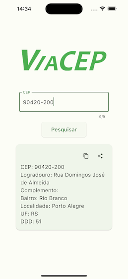
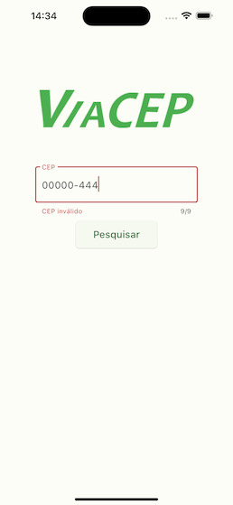

# ViaCep

Este é um aplicativo Flutter para consulta de CEPs (Códigos de Endereçamento Postal) usando a API do ViaCEP.

## Descrição

O aplicativo permite que os usuários insiram um CEP e recuperem informações detalhadas sobre o endereço associado, incluindo logradouro, complemento, bairro, localidade, UF e DDD. O aplicativo foi desenvolvido como parte do curso do Jamilton Damaceno na Udemy.

https://www.udemy.com/course/desenvolvimento-android-e-ios-com-flutter/

## Funcionalidades

- Entrada do CEP com máscara de formatação `00000-000`
- Validação do CEP com mensagem de erro para CEPs inválidos
- Exibição dos detalhes do endereço em um card
- Botão para compartilhar (função a ser implementada)

## Capturas de Tela







## Como Executar

### Pré-requisitos

- Flutter instalado
- Dependências do Flutter resolvidas

### Passos

1. Clone o repositório:
    ```sh
    git clone https://github.com/olavogiamp/viacep.git
    ```
2. Navegue até o diretório do projeto:
    ```sh
    cd nome-do-repositorio
    ```
3. Instale as dependências:
    ```sh
    flutter pub get
    ```
4. Execute o aplicativo:
    ```sh
    flutter run
    ```

### Gerar APK

Para gerar o APK de release:
```sh
flutter build apk

O APK gerado estará localizado em build/app/outputs/flutter-apk/app-release.apk.

### Configuração Adicional
Para permitir o acesso à internet no Android, adicione a seguinte permissão no arquivo android/app/src/main/AndroidManifest.xml:

<uses-permission android:name="android.permission.INTERNET"/>

### Contribuição
Sinta-se à vontade para abrir issues e enviar pull requests. Toda contribuição é bem-vinda!

